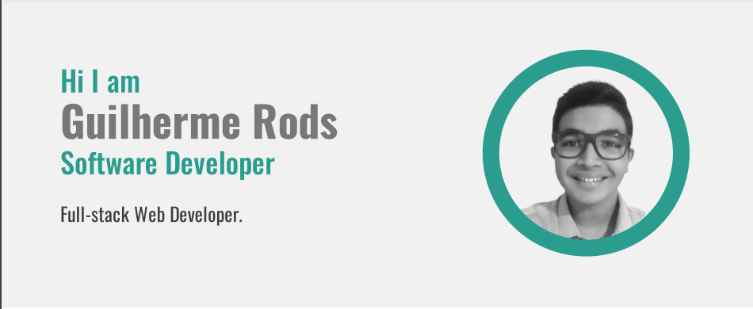

### Hi there, Guilherme Here 👋

  

I am a Full-stack Web Developer who is exploring Backend and Frontend while facilitating the world with technology :slightly_smiling_face:
 
 🔭 I currently work as a software engineer at Mz Group.
 
 🌱 At the moment I'm learning .
 
 :books: I want to learn  and .
 
 💬 Ask me about Full Stack Development and any Tech-related stuff.

 

---

### Tech & Tools Preference

 

### Languages I know a little bit
  

---

### You can find in me in the web 
<!-- [][website] -->
[][twitter]
[][linkedin]
[][instagram]

 

---

Let's connect 👨‍💻 and forge the future together.😁✌

**Check the Repositories and don't forget to give a star.** 👇

:star: From [Mr-Guilherme](https://github.com/Mr-Guilherme)

<!-- [website]:  -->
[twitter]: https://twitter.com/Guilherme_Rod_/
[instagram]: https://www.instagram.com/guilherme_mrods/
[linkedin]: https://www.linkedin.com/in/guilherme-marcelino-rodrigues-854bb21a9/

<!--
**Mr-Guilherme/Mr-Guilherme** is a ✨ _special_ ✨ repository because its `README.md` (this file) appears on your GitHub profile.

Here are some ideas to get you started:

- 🔭 I’m currently working on ...
- 🌱 I’m currently learning ...
- 👯 I’m looking to collaborate on ...
- 🤔 I’m looking for help with ...
- 💬 Ask me about ...
- 📫 How to reach me: ...
- 😄 Pronouns: ...
- ⚡ Fun fact: ...
-->
